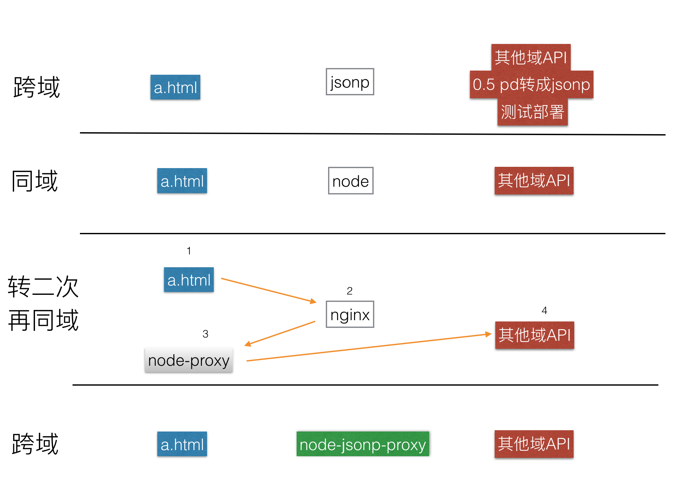
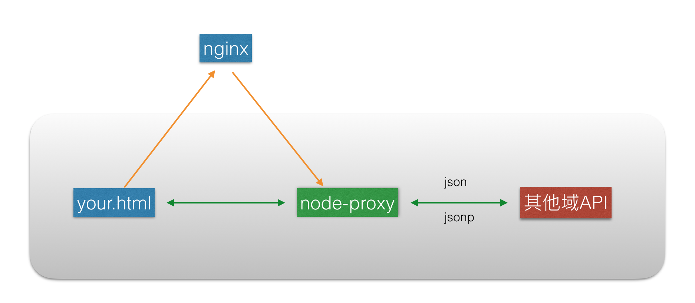

# rewrite2

> 你还在为接口转发和跨域发愁么？




## Features



1. rewrite解决跨域问题
1. 直接rewrite成jsonp接口(同机房更好)
1. 支持http和https转换
1. 配置化，无须部署
1. 收益=(接口个数x*0.5pd) + (node项目部署次数y*node项目部署时间)

## Install

```
$ npm i -S rewrite2
```

## Usages

### 1)最简单的方式

```
rewrite2.proxy(req, res, url)
```

支持jsonp

```
rewrite2.jsonp_proxy(req, res, url)
```

or

```
rewrite2.jsonp_proxy(req, res, {
	url: url,
	jsonp: true
})
```

###  2)使用k/v配置方式

```
rewrite2.proxy(req, {
  protocol: 'http',
  url: 'http://anyproxy.io/',
  hostname: 'anyproxy.io',
  port: 80,
  path: '/',
  method: 'GET',
  headers: {
    Host: 'anyproxy.io',
    'Proxy-Connection': 'keep-alive',
    'User-Agent': '...'
  },
  body: '...',
})
```

### 3)创建server

```
const rewrite2 = require(".");
const config = require("./test/config.json");

rewrite2.server(config).listen(3000, "127.0.0.1");
```

## config

- [x] url
- [x] host = hostname + port
- [x] hostname
- [x] port
- [x] path
- [x] method
- [x] protocol
- [x] jsonp:true
- [x] jsonp_function: 'callback'
- [x] body(mock response body support string, json, jsonp)
- filter(options) {}
- inspect

## API

- rewrite2.proxy(req, res, url|config)
- rewrite2.jsonp_proxy(req, res, url|config)
- rewrite2.server(config)

## Contributing

1. Fork it
2. Create your feature branch (`git checkout -b my-new-feature`)
3. Commit your changes (`git commit -am 'Add some feature'`)
4. Push to the branch (`git push origin my-new-feature`)
5. Create new Pull Request

## 版本历史

- v1.0.0 初始化版本

## 欢迎fork和反馈

- write by `i5ting` i5ting@126.com

如有建议或意见，请在issue提问或邮件

## License

this repo is released under the [MIT
License](http://www.opensource.org/licenses/MIT).
